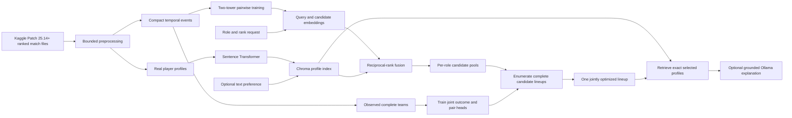

# LoL Joint Team Recommender with RAG

A real-data-only League of Legends teammate recommender. A trained two-tower retrieves candidates for the four open
roles around an anonymous finder. A second trained model scores every complete four-player combination, including
pair interactions, champion-pool features, and role-relative playstyle statistics. A local Sentence Transformer and
Chroma index interpret natural-language preferences and ground optional local Ollama lineup explanations.

## Dataset

This project uses the real ranked-match records from
[Patch 25.14+ (LoL) League of Legends Ranked Games](https://www.kaggle.com/datasets/californianbill/patch-25-14-lol-league-of-legends-ranked-games),
published by Kaggle user `californianbill`. Download the source files from Kaggle and place them in `data/` before
running the preprocessing pipeline. The raw dataset is not redistributed by this repository.



## Architecture

### Trained recommendation model

The query tower encodes:

- Finder primary role and rank.
- Open teammate role.
- Optional requested champion.

The candidate tower encodes:

- Real candidate identity.
- Recorded primary role and rank.
- Most-played champion.
- Normalized historical match count, win rate, KDA, kills, deaths, assists, vision, gold, and damage.

Training examples are directed player pairs observed on the same real team. Each positive is trained against a
sampled real player from the same target role using pairwise logistic ranking loss. Winning-team positives receive a
small training weight increase. Match-level chronological train, validation, and test windows prevent future match
events from leaking into training.

### RAG

Real profile summaries are embedded locally with `sentence-transformers/all-MiniLM-L6-v2` and persisted in Chroma.
When a text preference is supplied, role-scoped RAG results and two-tower results are combined using weighted
reciprocal-rank fusion to form the candidate pools. The trained joint model selects the final lineup; the LLM is not
the ranker.

### Joint lineup model

Only fully observed five-role teams that actually occurred are eligible for second-stage training. Each training view
removes one member as the anonymous finder and keeps the other four real teammates unchanged. The model learns a
complete-lineup outcome score plus the six pair-interaction scores among those four players. Inputs include frozen
two-tower player embeddings, weighted recorded champion-pool embeddings, champion-pool depth/entropy/concentration,
and role-relative experience, win rate, KDA, vision, damage, and assists.

At serving time, the engine forms the Cartesian product of the real per-role candidate pools, scores every complete
combination in one batch, and selects the highest learned outcome score. It never fills a missing role with a fake
player or a hardcoded score.

`/team/scout` retrieves the four selected players' exact Chroma documents and sends those, the recorded champion and
playstyle evidence, and explicitly labeled model scores to the local Ollama generator. Missing evidence or an
unavailable Ollama server produces an explicit error instead of fabricated context. Ollama writes only the explanation
and never selects candidates.

## Measured results

The trained checkpoint uses 58,850 train pairs for epoch selection and 69,378 train+validation pairs for final
training. Evaluation uses 15,277 untouched future matches.

| Held-out task | Query context | Model | NDCG@10 | Recall@10 | MRR |
|---|---|---|---:|---:|---:|
| Successful future teammates | Role, rank, target champion | Two tower | **0.3557** | **0.5865** | **0.3007** |
| Successful future teammates | Role and rank only | Two tower | **0.1810** | **0.3667** | **0.1476** |
| Successful future teammates | Role and rank only | Popularity | 0.1403 | 0.2836 | 0.1204 |
| Successful future teammates | Role and rank only | Random | 0.0543 | 0.1243 | 0.0559 |
| All future teammates | Role, rank, target champion | Two tower | **0.3320** | **0.5459** | **0.2841** |
| All future teammates | Role and rank only | Two tower | **0.1692** | **0.3413** | **0.1405** |

The separate RAG benchmark uses 40 controlled queries over 2,854 real profiles:

| Retriever | NDCG@10 | Precision@10 | Hit rate@10 |
|---|---:|---:|---:|
| Dense Sentence Transformer | 0.3792 | 0.3675 | 1.0000 |
| Grounded hybrid RAG | **0.8641** | **0.8550** | **1.0000** |
| TF-IDF | 0.4483 | 0.4400 | 0.7500 |
| Random | 0.2076 | 0.2150 | 0.8750 |

The latest joint-team evaluation uses four rolling temporal folds over 196 non-overlapping out-of-time teams. The
deployment-aligned seed reaches **0.5615 ROC-AUC [0.4779, 0.6422]**, with **0.5446 ± 0.0401** across five seeds. No pair,
champion-pool, or playstyle ablation produced a statistically reliable improvement. The joint scorer therefore remains
an experimental architecture, not a validated win predictor. See the [rolling benchmark](docs/team_benchmark.md),
[two-tower evaluation](docs/two_tower_evaluation.md), and [RAG evaluation](docs/rag_evaluation.md).

## Setup

Python 3.11 or newer is recommended.

```powershell
python -m venv .venv
.venv\Scripts\Activate.ps1
python -m pip install -r requirements.txt
Copy-Item .env.example .env
```

Scout generation defaults to a free local Ollama model. Install [Ollama](https://ollama.com/download), then download
the configured model once:

```powershell
ollama pull gemma3:4b
```

The Ollama desktop app normally starts its local API automatically. If it is not running, start it with `ollama serve`.
The default `.env.example` points Scout to Ollama's native API at `http://127.0.0.1:11434`. No API key or paid inference
credit is required.

Place real Riot CSV, JSON, JSONL, or NDJSON exports in `data/`. The root data directory, local Chroma database, and
`.env` secrets are excluded from Git.

## Build data and train

The large-file preprocessor streams the raw wide CSV in bounded chunks and writes compact artifacts:

```powershell
python -m src.data.preprocess_large --chunk-size 100
python -m src.evaluation.events --source data/matchData.csv --chunk-size 100
```

If `data/evaluation/ranked_match_events.parquet` already exists, train directly from that compact 11 MB table:

```powershell
python -m src.recsys.train --device cuda
python -m src.recsys.train_team --device cuda
python -m src.evaluation.team_benchmark --device cuda
```

The first command trains the candidate generator. The second trains the observed-lineup reranker and binds it to the
exact two-tower checkpoint by SHA-256; retrain the team model after replacing the two-tower artifact. Both commands
select an epoch chronologically, retrain on train + validation, and evaluate once on future test data. Rebuild and
evaluate RAG separately:

```powershell
python -m src.data.reindex_profiles
python -m src.evaluation.rag
python -m src.evaluation.rag_human prepare --cases 50 --reviewers 2
```

The RAG human-evaluation command writes 50 real-lineup cases and a blank two-reviewer sheet under ignored `data/`.
It does not call a generator or manufacture ratings. With Ollama running, add `--generate` to create the grounded
reports locally for free, then have two human reviewers complete the sheet and run
`python -m src.evaluation.rag_human score`.

## Run

Start FastAPI:

```powershell
uvicorn src.api.main:app --reload --host 127.0.0.1 --port 8001
```

Start Gradio in another terminal:

```powershell
.\.venv\Scripts\python.exe -m src.ui.app
```

Open `http://127.0.0.1:7860`. API documentation is at `http://127.0.0.1:8001/docs`.

This repository's scout generator remains local Ollama. The Gradio interface calls the FastAPI routes, so the
recommendation, complete-lineup scout, and individual-candidate scout behavior stays separated and testable.

## API contract

- `GET /health`: checkpoint, training metadata, profile count, index count, and configured devices.
- `POST /team/recommend`: jointly optimized four-player lineup plus per-role alternatives.
- `POST /team/scout`: RAG-grounded explanation of a complete selected lineup.
- `POST /scout`: retrieval-grounded tactical report for one selected real candidate.

Example recommendation request:

```json
{
  "primary_role": "MID",
  "tier": "GOLD",
  "rank": "II",
  "target_champions": {"JUNGLE": "Vi", "SUPPORT": "Nautilus"},
  "preference": "Reliable vision and team-oriented setup",
  "candidates_per_role": 3,
  "max_tier_gap": 1
}
```

If no real candidate survives a hard role/rank constraint, the API returns an empty or partial result. It never
injects a placeholder candidate.

`tier` is required for matchmaking. The Gradio interface defaults the finder to `FILL` at `PLATINUM IV`;
unrestricted rank matchmaking is intentionally unavailable.

## Tests

```powershell
pytest -q
```
