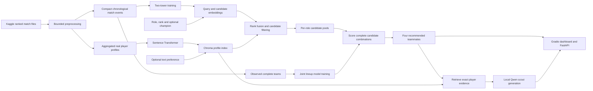

# League of Legends: Team Recommender

A real-data-only teammate recommendation system combining a **trained two-tower model**,
a **joint lineup scorer**, and **retrieval-augmented generation (RAG)**.

Choose your primary role and rank to find four teammates for the remaining roles. Add
preferences or target champions to refine the search, then request grounded scouting
reports for individual players or the complete lineup.

The project uses recorded match history—not live matchmaking data. It never invents
players or inserts placeholder recommendations when no real candidate qualifies.

## What it does

- **Finds role-appropriate candidates:** filters recorded players by role, rank, and optional champion history.
- **Ranks candidates in context:** uses learned query and player embeddings, combined with semantic retrieval when a text preference is supplied.
- **Selects a lineup jointly:** scores complete combinations from the candidate pools using player interactions, champion pools, and role-relative statistics.
- **Explains the evidence:** retrieves exact player profiles from Chroma and uses a local language model to generate optional scouting reports.

Your slot is anonymous: it supplies role and rank context, not a real player identity.
The default is **Fill, Platinum IV**. Live recommendations support Platinum, Emerald,
Diamond, Master, Grandmaster, and Challenger.

## Architecture



### 1. Trained two-tower retrieval

The query tower encodes your role and rank, the open teammate role, and an optional
requested champion. The candidate tower encodes player identity, recorded role and rank,
main champion, and normalized historical performance statistics.

Training uses real same-team player pairs with role-matched negatives sampled from real
players. Winning-team positives receive a small additional weight. Match-level
chronological train, validation, and test splits keep future match events out of training.

These labels measure historical co-play, not human judgments of ideal teammates.
Recommendations are not restricted to players who previously played together.

### 2. Joint lineup scoring

The second model trains on fully observed five-role teams. Each training view holds out
one member as the anonymous finder and uses the other four teammates. Features include
frozen two-tower embeddings, recorded champion-pool embeddings, pool depth and concentration,
and role-relative experience, win rate, KDA, vision, damage, and assists.

At inference, the engine scores all complete combinations within the retrieved candidate
pools and selects the highest-scoring lineup. It learns a lineup outcome score and six
pair-interaction scores. This is optimization within those pools, not an exhaustive search
over every player in the dataset.

**The joint scorer remains experimental. Its displayed scores are not calibrated win
probabilities or proven measures of team chemistry.**

### 3. RAG retrieval and scouting

Player narratives are derived from recorded metrics, embedded with
`sentence-transformers/all-MiniLM-L6-v2`, and stored in Chroma. Text preferences contribute
role-scoped retrieval results, combined with two-tower rankings through weighted
reciprocal-rank fusion.

Scouting retrieves the selected players' exact indexed documents. A local
`Qwen/Qwen2.5-0.5B-Instruct` model generates concise explanations from that evidence and
explicitly labeled model estimates. **The language model explains; it does not select players.**
Missing evidence or a generation failure produces an explicit error, not a fabricated report.

## Tech stack

| Component | Implementation |
| --- | --- |
| Interface | Gradio with a League-inspired theme |
| API | FastAPI |
| Learned ranking and lineup scoring | PyTorch |
| Profile retrieval | Sentence Transformers and ChromaDB |
| Scout generation | Local Qwen through Transformers |
| Data processing and evaluation | Pandas, NumPy, PyArrow, scikit-learn |

## Dataset

This project uses
[Patch 25.14+ (LoL) League of Legends Ranked Games](https://www.kaggle.com/datasets/californianbill/patch-25-14-lol-league-of-legends-ranked-games),
published by Kaggle user **californianbill**.

Download the source data and place `matchData.csv` in `data/` to rebuild the pipeline.
The raw dataset is not redistributed by this repository. Review the dataset's license
and handling of public player identifiers before redistributing derived artifacts.

Large files are processed in bounded chunks. Serving uses compact player profiles,
trained checkpoints, and indexed vectors; it does not read the raw match CSV.

## Project structure

```text
app.py                       Complete local application entry point
src/
  data/                      Preprocessing and factual profile generation
  recsys/                    Two-tower and joint lineup models
  rag/                       Chroma retrieval and portable embedding support
  llm/                       Grounded prompts, local generation and report cache
  api/                       FastAPI request validation and endpoints
  ui/                        Gradio dashboard and styling
  evaluation/                Ranking, retrieval and lineup benchmarks
artifacts/
  two_tower/                 Trained candidate model and metadata
  team_model/                Matching joint model and metadata
data/                        Local real data and processed outputs; Git-ignored
docs/                        Evaluation reports and deployment instructions
tests/                       Automated regression tests
requirements.txt             Python dependencies
.env.example                 Configuration template
```

## Local setup

Use **Python 3.12**. Run the following from the repository root in PowerShell:

```powershell
python -m venv .venv
.\.venv\Scripts\Activate.ps1
python -m pip install -r requirements.txt
if (-not (Test-Path .env)) { Copy-Item .env.example .env }
```

The copy command preserves an existing `.env`. For local CPU serving, configure these
values in that file:

```dotenv
LOL_UI_BACKEND=local
LOL_TWO_TOWER_DEVICE=cpu
RAG_EMBEDDING_DEVICE=cpu
SCOUT_DEVICE=cpu
SCOUT_MODEL=Qwen/Qwen2.5-0.5B-Instruct
SCOUT_MAX_NEW_TOKENS=192
GRADIO_SERVER_NAME=127.0.0.1
GRADIO_SERVER_PORT=7860
```

No API key, paid inference endpoint, or separate model server is required.
The embedding model and scout model download when first needed, unless already cached.
Leave several GB of RAM available: Qwen's CPU weights alone use roughly 2 GB, with
additional memory needed for inference and the rest of the app.

### Required artifacts

Before starting the app, make sure you have:

- `artifacts/two_tower/model.pt` and `metadata.json`.
- `artifacts/team_model/model.pt` and `metadata.json`, matching that two-tower checkpoint.
- Real processed profiles at `data/processed/player_profiles.jsonl`.

A packaged deployment may instead supply `deployment/player_profiles.jsonl`; the app
automatically prefers that location when present. Matching `rag_embeddings.npz` files
beside the profiles allow Chroma initialization without re-encoding every profile.

**If these artifacts already exist, skip preprocessing and training.** A fresh clone may
not contain the Git-ignored processed data; use the rebuild instructions below rather
than expecting demonstration players or fallback results.

## Run the app

With the environment activated:

```powershell
python app.py
```

Open [localhost:7860](http://127.0.0.1:7860). A separate FastAPI process is not needed for
the default local mode.

1. Set **Your Primary Role**, **Your rank tier**, and **Your division**.
2. Expand **Advanced search settings** for candidate counts, tier gap, team preferences,
   or target champions.
3. Click **Build my team**.
4. Use **Why this candidate?** to generate a report inside a player's card.
5. Use **Explain why this lineup complements itself** for the separate whole-team report.

The app initializes retrieval and ranking before accepting requests. Qwen loads on the
first scout request, and new CPU-generated reports can take time. Successful reports
are cached in memory, separately keyed by report type, evidence, context, and model
settings. Restarting clears that cache; failed reports are not cached.

Common inappropriate English name fragments are masked in the interface and reports.
This is best-effort filtering, not exhaustive multilingual moderation. Source data and
player lookup IDs are unchanged.

### Optional standalone API

To serve external clients:

```powershell
python -m uvicorn src.api.main:app --host 127.0.0.1 --port 8001
```

Open [the API documentation](http://127.0.0.1:8001/docs).
To connect Gradio to this server instead of using the in-process backend, set
`LOL_UI_BACKEND=http` and `LOL_API_URL=http://127.0.0.1:8001`, then start Gradio in another terminal.

| Endpoint | Purpose |
| --- | --- |
| `GET /health` | Model, profile and index status |
| `POST /team/recommend` | Joint lineup recommendations and per-role alternatives |
| `POST /team/scout` | Grounded report for four selected teammates |
| `POST /scout` | Grounded report for one real candidate |

Example body for `POST /team/recommend`:

```json
{
  "primary_role": "MID",
  "tier": "PLATINUM",
  "rank": "II",
  "target_champions": {"JUNGLE": "Vi", "SUPPORT": "Nautilus"},
  "preference": "Reliable vision and team-oriented setup",
  "candidates_per_role": 3,
  "max_tier_gap": 1
}
```

Rank is required. If no real candidate satisfies the constraints, the response is empty
or partial; the system never inserts a placeholder player.

## Rebuild data, models and index

These are offline preparation steps, not commands to repeat on every startup.
Training replaces model artifacts, so preserve any checkpoints you want to keep.

### 1. Preprocess real match history

```powershell
python -m src.data.preprocess_large --source data/matchData.csv --chunk-size 100 --skip-index
python -m src.evaluation.events --source data/matchData.csv --chunk-size 100
```

This separates compact player profiles from the chronological event table used for
training. The small chunk size limits memory pressure when reading the raw CSV.

### 2. Train both models

```powershell
python -m src.recsys.train --device cpu
python -m src.recsys.train_team --device cpu
```

Use `--device cuda` instead only if your machine has a supported GPU and a CUDA-enabled
PyTorch installation. Retrain the joint model after replacing the two-tower checkpoint:
the artifacts are bound by checkpoint hash.

Training selects epochs using chronological validation data before final held-out
evaluation. See the saved metadata and evaluation documents for experiment settings;
rerunning with different settings does not reproduce the recorded scores automatically.

### 3. Build the retrieval index

```powershell
python -m src.data.reindex_profiles
```

This enriches the real profiles and rebuilds their Chroma index. It runs the embedding
model, so allow additional time and memory. Do not manually edit deployment profiles
without rebuilding their matching vectors and integrity manifest.

## Latest recorded evaluation

The two-tower checkpoint used **58,850 training pairs** for epoch selection and
**69,378 train+validation pairs** for final training. The held-out window contains
**15,277 future matches**.

| Held-out task | Query context | Model | NDCG@10 | Recall@10 | MRR |
| --- | --- | --- | ---: | ---: | ---: |
| Successful future teammates | Role, rank, target champion | Two tower | **0.3557** | **0.5865** | **0.3007** |
| Successful future teammates | Role and rank only | Two tower | **0.1810** | **0.3667** | **0.1476** |
| Successful future teammates | Role and rank only | Popularity | 0.1403 | 0.2836 | 0.1204 |
| Successful future teammates | Role and rank only | Random | 0.0543 | 0.1243 | 0.0559 |
| All future teammates | Role, rank, target champion | Two tower | **0.3320** | **0.5459** | **0.2841** |
| All future teammates | Role and rank only | Two tower | **0.1692** | **0.3413** | **0.1405** |

The separate retrieval benchmark uses **40 controlled queries** over **2,854 real profiles**:

| Retriever | NDCG@10 | Precision@10 | Hit rate@10 |
| --- | ---: | ---: | ---: |
| Dense Sentence Transformer | 0.3792 | 0.3675 | 1.0000 |
| Grounded hybrid retrieval | **0.8641** | **0.8550** | **1.0000** |
| TF-IDF | 0.4483 | 0.4400 | 0.7500 |
| Random | 0.2076 | 0.2150 | 0.8750 |

The joint-team benchmark uses **four rolling temporal folds** over **196 non-overlapping
out-of-time teams**. The deployment-aligned seed reaches **0.5615 ROC-AUC**
(95% CI **[0.4779, 0.6422]**), with **0.5446 ± 0.0401** across five seeds.
No pair, champion-pool, or playstyle ablation showed a statistically reliable improvement.

These are separate evaluation tasks—not interchangeable measures of recommendation
quality. In particular, retrieval scores do **not** evaluate generated scout prose.
The current Qwen generator has not yet received a human quality evaluation.

Detailed protocols, confidence intervals, baselines, and limitations:

- [Two-tower evaluation](docs/two_tower_evaluation.md)
- [RAG retrieval evaluation](docs/rag_evaluation.md)
- [Rolling joint-team benchmark](docs/team_benchmark.md)

### Run evaluation

```powershell
python -m src.evaluation.team_benchmark --device cpu
python -m src.evaluation.rag
python -m src.evaluation.rag_human prepare --cases 50 --reviewers 2
```

The rolling benchmark trains fold-specific models and is more expensive than a serving
check. The human-evaluation command prepares real-lineup cases and blank reviewer sheets;
it does not invent ratings. Add `--generate` to generate reports with the local model, have
reviewers complete the sheets, then run:

```powershell
python -m src.evaluation.rag_human score
```

## Tests

```powershell
python -m pytest -q
```

The regression suite covers data handling, ranking, exact-profile retrieval, API contracts,
candidate-versus-team report isolation, interface behavior, and deployment integrity.

## Limitations

- Historical co-play is a proxy label, not proof that recommended players will work well together.
- The joint scorer is not a validated win predictor; its confidence interval includes chance.
- Controlled retrieval labels are derived from profile attributes, not independent human preference judgments.
- Scouting can contain unsupported claims despite grounded prompts; inspect reports critically.
- The dataset does not establish current availability, communication quality, personality, or tilt risk.
- Recorded ranks, champion pools, and performance may not reflect a player's current state.

## Deployment

For the container-based deployment workflow, see [Google Cloud Run deployment](docs/cloud_run.md).
Local development does not require a cloud account.

## Attribution

This is an unofficial fan-made portfolio project, not endorsed or sponsored by Riot Games.
The interface uses Riot's Beaufort for LoL font for its main title only; see
[font attribution and terms](assets/fonts/NOTICE.md).
