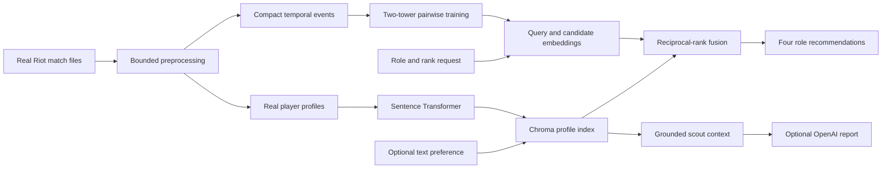

# LoL Two-Tower Team Recommender with RAG

A real-data-only League of Legends teammate recommender. A trained two-tower model fills the four roles around an
anonymous finder, while a local Sentence Transformer and Chroma index interpret optional natural-language team
preferences. An OpenAI-powered scout can explain a selected recommendation using only its retrieved evidence.

No synthetic players, mock recommendations, or random fallback candidates are used.



## Architecture

### Trained recommendation model

The query tower encodes:

- Finder primary role and rank.
- Open teammate role.
- Optional requested champion.

The candidate tower encodes:

- Real candidate identity.
- Recorded primary role and rank.
- Most-played champion.
- Normalized historical match count, win rate, KDA, kills, deaths, assists, vision, gold, and damage.

Training examples are directed player pairs observed on the same real team. Each positive is trained against a
sampled real player from the same target role using pairwise logistic ranking loss. Winning-team positives receive a
small training weight increase. Match-level chronological train, validation, and test windows prevent future match
events from leaking into training.

### RAG

Real profile summaries are embedded locally with `sentence-transformers/all-MiniLM-L6-v2` and persisted in Chroma.
When a text preference is supplied, role-scoped RAG results and two-tower results are combined using weighted
reciprocal-rank fusion. The two-tower remains the recommendation model; the LLM is not the ranker.

`/scout` retrieves the selected candidate's exact Chroma document and sends that evidence plus computed real stats to
the OpenAI Responses API. Missing evidence or credentials produces an explicit error instead of fabricated context.

## Measured results

The trained checkpoint uses 58,850 train pairs for epoch selection and 69,378 train+validation pairs for final
training. Evaluation uses 15,277 untouched future matches.

| Held-out task | Query context | Model | NDCG@10 | Recall@10 | MRR |
|---|---|---|---:|---:|---:|
| Successful future teammates | Role, rank, target champion | Two tower | **0.2994** | **0.5249** | **0.2487** |
| Successful future teammates | Role and rank only | Two tower | **0.1667** | **0.3352** | **0.1379** |
| Successful future teammates | Role and rank only | Popularity | 0.1403 | 0.2836 | 0.1204 |
| Successful future teammates | Role and rank only | Random | 0.0543 | 0.1243 | 0.0559 |
| All future teammates | Role, rank, target champion | Two tower | **0.2800** | **0.4970** | **0.2333** |
| All future teammates | Role and rank only | Two tower | **0.1568** | **0.3201** | **0.1297** |

The separate RAG benchmark uses 40 controlled queries over 2,854 real profiles:

| Retriever | NDCG@10 | Precision@10 | Hit rate@10 |
|---|---:|---:|---:|
| Dense Sentence Transformer | 0.3798 | 0.3675 | 1.0000 |
| Grounded hybrid RAG | **0.8701** | **0.8600** | **1.0000** |
| TF-IDF | 0.4483 | 0.4400 | 0.7500 |
| Random | 0.2076 | 0.2150 | 0.8750 |

See [two-tower evaluation](docs/two_tower_evaluation.md) and [RAG evaluation](docs/rag_evaluation.md) for confidence
intervals, leakage controls, and limitations.

## Setup

Python 3.11 or newer is recommended.

```powershell
python -m venv .venv
.venv\Scripts\Activate.ps1
python -m pip install -r requirements.txt
Copy-Item .env.example .env
```

Place real Riot CSV, JSON, JSONL, or NDJSON exports in `data/`. The root data directory, local Chroma database, and
`.env` secrets are excluded from Git.

## Build data and train

The large-file preprocessor streams the raw wide CSV in bounded chunks and writes compact artifacts:

```powershell
python -m src.data.preprocess_large --chunk-size 100
python -m src.evaluation.events --source data/matchData.csv --chunk-size 100
```

If `data/evaluation/ranked_match_events.parquet` already exists, train directly from that compact 11 MB table:

```powershell
python -m src.recsys.train --device cuda
```

The command selects an epoch on chronological validation data, retrains on train + validation, saves the deployable
checkpoint under `artifacts/two_tower/`, and writes the held-out report. Rebuild and evaluate RAG separately:

```powershell
python -m src.data.reindex_profiles
python -m src.evaluation.rag
```

## Run

Start FastAPI:

```powershell
uvicorn src.api.main:app --reload --host 127.0.0.1 --port 8001
```

Start Streamlit in another terminal:

```powershell
.\.venv\Scripts\streamlit.exe run src/ui/app.py
```

Open `http://127.0.0.1:8501`. API documentation is at `http://127.0.0.1:8001/docs`.

## API contract

- `GET /health`: checkpoint, training metadata, profile count, index count, and configured devices.
- `POST /team/recommend`: four open-role recommendation lists for an anonymous finder.
- `POST /scout`: retrieval-grounded tactical report for one selected real candidate.

Example recommendation request:

```json
{
  "primary_role": "MID",
  "tier": "GOLD",
  "rank": "II",
  "target_champions": {"JUNGLE": "Vi", "SUPPORT": "Nautilus"},
  "preference": "Reliable vision and team-oriented setup",
  "candidates_per_role": 3,
  "max_tier_gap": 1
}
```

If no real candidate survives a hard role/rank constraint, the API returns an empty or partial result. It never
injects a placeholder candidate.

## Tests

```powershell
pytest -q
```
