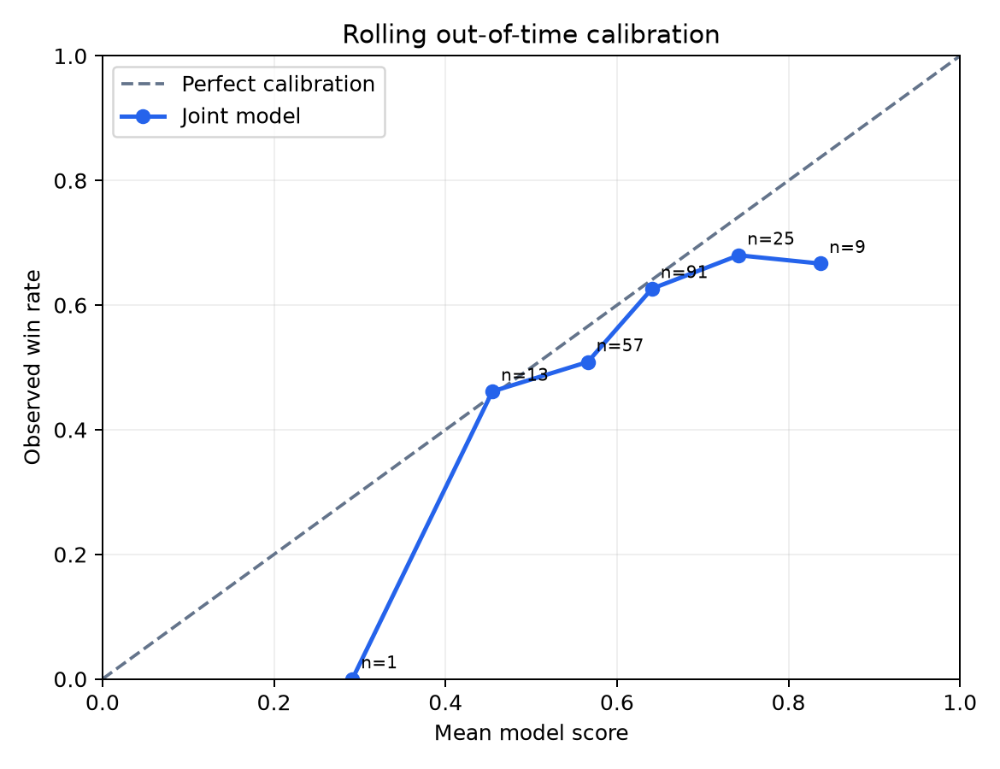

# Rolling Joint-Team Benchmark

This benchmark reuses only the existing compact real-match history. It does not construct teams, substitute
players, impute members, or create outcome labels. Expanding chronological folds use non-overlapping
future test blocks. The complete joint model is repeated across 5 team-model seeds.

## Protocol

- Rolling folds: **4**
- Team-model seeds: **42, 43, 44, 45, 46**
- Fixed fold-specific two-tower seed: **42**
- Epoch selection uses only the validation block immediately before each fold's test block.
- Player profiles and embeddings are rebuilt from each fold's training history only.
- Test blocks do not overlap across folds.

`joint_full` is seed 42, matching the deployment seed. The five-seed ensemble is shown separately; seed
mean and standard deviation quantify training instability.

## Out-of-time results

| Model | ROC-AUC (match-bootstrap 95% CI) | PR-AUC (95% CI) | Brier | ECE |
|---|---:|---:|---:|---:|
| joint_full | 0.5615 [0.4779, 0.6422] | 0.6419 [0.5646, 0.7364] | 0.2407 | 0.0410 |
| joint_full_five_seed_ensemble | 0.5284 [0.4334, 0.6135] | 0.6264 [0.5449, 0.7235] | 0.2481 | 0.0755 |
| without_explicit_pair_head | 0.5311 [0.4488, 0.6045] | 0.6469 [0.5638, 0.7324] | 0.2455 | 0.0815 |
| without_explicit_champion_pool | 0.5043 [0.4268, 0.5837] | 0.6130 [0.5348, 0.7140] | 0.2452 | 0.0750 |
| without_explicit_playstyle | 0.5402 [0.4578, 0.6171] | 0.6443 [0.5653, 0.7345] | 0.2479 | 0.1139 |
| mean_historical_win_rate | 0.4749 [0.3917, 0.5595] | 0.5924 [0.5112, 0.6935] | 0.2461 | 0.0368 |
| mean_player_popularity | 0.5260 [0.4446, 0.6096] | 0.5968 [0.5196, 0.6879] | — | — |
| independent_two_tower_score | 0.5244 [0.4344, 0.6173] | 0.6033 [0.5247, 0.6931] | — | — |
| logistic_no_learned_interactions | 0.5538 [0.4656, 0.6327] | 0.6324 [0.5534, 0.7242] | 0.2460 | 0.0958 |
| historical_constant_prior | 0.5335 [0.4712, 0.5968] | 0.6138 [0.5452, 0.6817] | 0.2432 | 0.0316 |
| random_score | 0.5448 [0.4660, 0.6215] | 0.6257 [0.5516, 0.7182] | — | — |

## Seed stability

| Seed | Pooled ROC-AUC |
|---:|---:|
| 42 | 0.5615 |
| 43 | 0.4811 |
| 44 | 0.5300 |
| 45 | 0.5735 |
| 46 | 0.5771 |

Mean ± standard deviation: **0.5446 ± 0.0401**.

## Rolling-fold coverage

| Fold | Train matches | Validation matches | Test matches | Source complete teams | Eligible teams | Coverage |
|---:|---:|---:|---:|---:|---:|---:|
| 1 | 50,921 | 10,184 | 10,185 | 76 | 61 | 80.3% |
| 2 | 61,105 | 10,185 | 10,184 | 70 | 47 | 67.1% |
| 3 | 71,290 | 10,184 | 10,184 | 52 | 35 | 67.3% |
| 4 | 81,474 | 10,184 | 10,185 | 84 | 53 | 63.1% |

## Paired ROC-AUC differences versus the joint model

Positive values favor the complete joint model.

Every comparison uses the deployment-aligned seed-42 joint model as its reference.

| Comparator | Reference | Δ ROC-AUC (95% CI) | Bootstrap p |
|---|---|---:|---:|
| historical_constant_prior | joint_full_seed_42 | 0.0279 [-0.0765, 0.1385] | 0.6180 |
| independent_two_tower_score | joint_full_seed_42 | 0.0370 [-0.0872, 0.1634] | 0.5740 |
| logistic_no_learned_interactions | joint_full_seed_42 | 0.0076 [-0.0703, 0.0828] | 0.8660 |
| mean_historical_win_rate | joint_full_seed_42 | 0.0865 [-0.0330, 0.1904] | 0.1520 |
| mean_player_popularity | joint_full_seed_42 | 0.0354 [-0.0878, 0.1472] | 0.6000 |
| random_score | joint_full_seed_42 | 0.0166 [-0.0935, 0.1259] | 0.7700 |
| without_explicit_champion_pool | joint_full_seed_42 | 0.0571 [-0.0428, 0.1603] | 0.2820 |
| without_explicit_pair_head | joint_full_seed_42 | 0.0304 [-0.0482, 0.1100] | 0.4400 |
| without_explicit_playstyle | joint_full_seed_42 | 0.0213 [-0.0473, 0.0918] | 0.4680 |

## Calibration

- Score 0.2–0.3: 1 teams, mean score 0.291, observed win rate 0.000.
- Score 0.4–0.5: 13 teams, mean score 0.455, observed win rate 0.462.
- Score 0.5–0.6: 57 teams, mean score 0.566, observed win rate 0.509.
- Score 0.6–0.7: 91 teams, mean score 0.641, observed win rate 0.626.
- Score 0.7–0.8: 25 teams, mean score 0.742, observed win rate 0.680.
- Score 0.8–0.9: 9 teams, mean score 0.837, observed win rate 0.667.

## Inference timing

- Fold 1: 125 real scenarios in 11.832 ms (0.0947 ms/scenario).
- Fold 2: 95 real scenarios in 16.282 ms (0.1714 ms/scenario).
- Fold 3: 71 real scenarios in 12.298 ms (0.1732 ms/scenario).
- Fold 4: 129 real scenarios in 11.684 ms (0.0906 ms/scenario).

## Interpretation constraints

- The original single future test window was inspected during development; rolling evaluation improves stability
  evidence but cannot recreate a never-observed final holdout without new matches.
- Logged outcomes evaluate observed teams. They cannot prove that a newly recommended counterfactual lineup would win.
- Explicit champion-pool and playstyle ablations remove the second-stage feature groups, but the frozen two-tower
  embedding still contains entangled main-champion and historical-statistic information.
- Only the team model is repeated across five seeds; the fold-specific two-tower seed is fixed to bound compute.
- Pair outputs inherit team outcome supervision and are not direct measurements of social chemistry.
